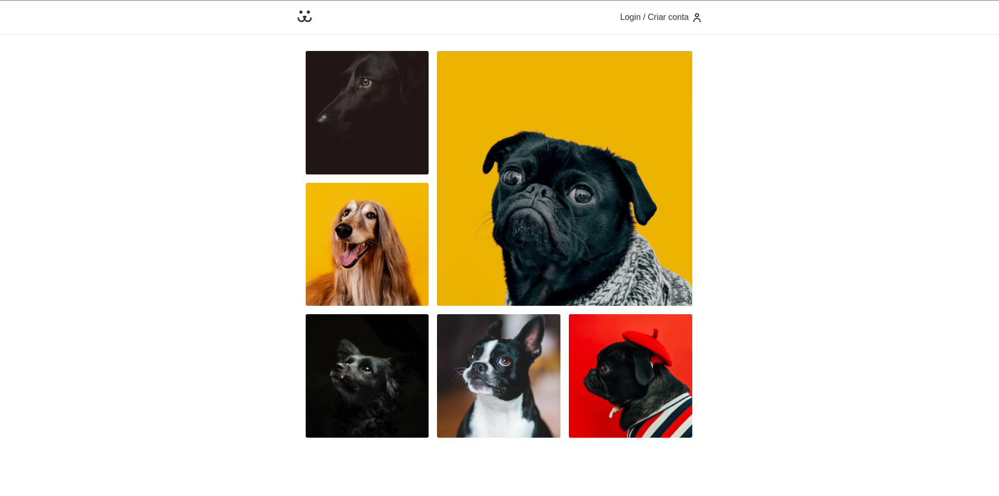

# Dogs project

This project is a practice on React course, by Origamid


<h1 style="color:#fb1">The Social media Page for your animal</h1>
<p align="center">

</p>

# Available Scripts

In this project, you can run:

```bash
 # Cloning the repository:
 git clone git@github.com:matheusmfeitoza/dogs.git

 # Opening the project folder:
 cd dogs  # You need to stay at folder when you cloned the project

 # Installing the dependencies:
 npm install or npm i

 # Run the project with dev mode
 npm run start

 # Build the project
 npm run build
```

## Technologies used in this project

- React
- React Router DOM
- Victory
- CSS Module

# Project Status

The project was been finalized.

## Matheus Marinho dev

Follow and share if you liked!

<div align='center' style="background-color:#fb1; color:#000">
    <p> Thank you for visit :heart:</p>
</div>
